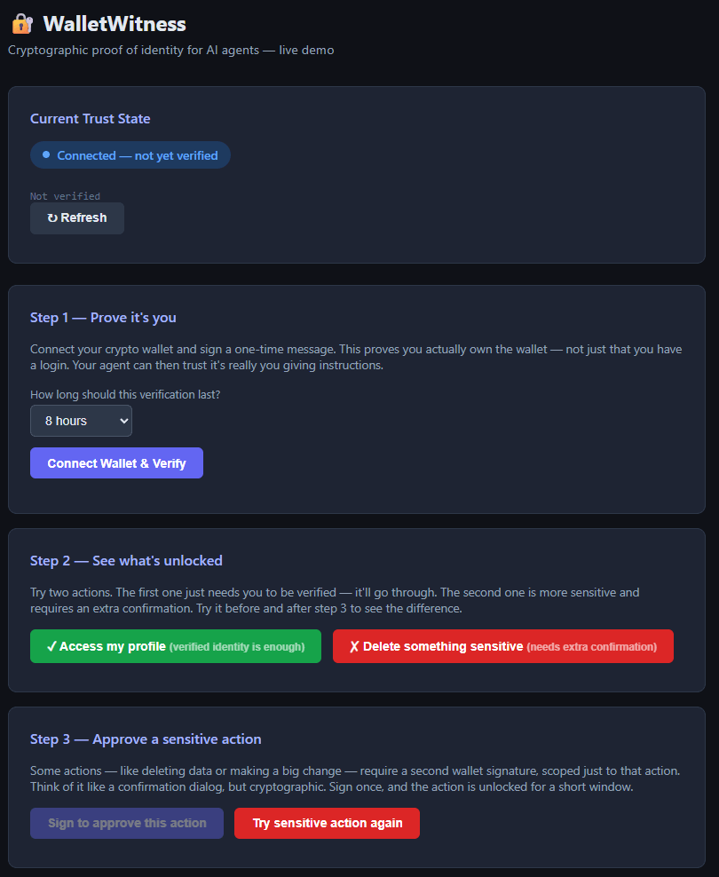

# WalletWitness

> *So your AI knows it's actually talking to you — not just someone with your session.*

An AI agent can be given a lot of trust. It can read your files, send messages on your behalf, manage your infrastructure. The more capable the agent, the more damage an impersonator can do.

The problem isn't authentication — most systems already have logins. The problem is that session tokens don't prove *identity*. A grabbed cookie, a leaked API key, a browser left open at a café: any of these let someone else walk into your agent's front door wearing your credentials.

Your agent is already asking a question it can't answer: *"is this actually my human?"* WalletWitness is built to answer it.

The answer is a cryptographic signature. Your wallet already proves *"this is me"* on-chain. WalletWitness brings that same proof into the AI interaction layer — so the agent can be confident the person giving sensitive instructions is the person who owns it.

This is also what protects against impersonation. It's not enough to block strangers. A stolen session *looks* like the real owner. A wallet signature *is* the real owner.

[](https://youtube.com/shorts/MI2eqzD9BiA)

▶️ **[Watch the demo](https://youtube.com/shorts/MI2eqzD9BiA)**

---

## Three Promises

WalletWitness does exactly three things and nothing else:

1. **Proof** — verify wallet ownership via a challenge/sign/verify flow (EIP-191)
2. **Continuity** — hold that proof as a time-bounded trust session so the user doesn't sign on every message
3. **Control** — let your app gate sensitive actions with scoped step-up signatures

> **WalletWitness proves and reports. Your app decides what each trust level is allowed to do.**

---

## Trust States

| State | What it means |
|---|---|
| `anonymous` | No session, no proof |
| `authenticated_unverified` | App session exists, but no wallet proof (or proof expired) |
| `verified_identity` | Wallet ownership proven — time-bounded, address-bound |
| `verified_action` | Short-lived scoped grant for one specific sensitive action |

Trust only moves **up** via cryptographic signature — never from conversation context or session inference.

---

## Packages

| Package | What it contains |
|---|---|
| `@walletwitness/core` | Challenge issuance, signature verification, trust session lifecycle, action grants, chain validation |
| `@walletwitness/server` | Express middleware — session attach, challenge route, verify route, protect middleware with policy callback |
| `walletwitness-demo` | Runnable end-to-end reference flow |

---

## Quick Start

```bash
npm install
npm test
```

---

## Prerequisites

**WalletWitness assumes you already have:**

- A **crypto wallet** (browser extension or mobile app) that supports Ethereum/EVM signing
- **Basic familiarity** with wallet signing, seed phrases, and gasless off-chain messages
- A **development environment** with Node.js and npm/yarn/pnpm

**What this project does NOT include:**

- Wallet setup guides or seed phrase management tutorials
- Recommendations for specific wallet software
- Blockchain education or crypto onboarding

**If you're new to crypto wallets:** You'll need to set one up and understand signing basics before using WalletWitness. This project is designed for developers who already have wallet infrastructure in place.

---

## Where it fits

WalletWitness works anywhere you have a server and a way for the user to sign with their wallet. Here's what that looks like in practice.

---

**Custom AI chat app** *(this is us — verified working)*

You've built your own chat interface where an AI agent helps you manage things. WalletWitness sits in the background: when you open a sensitive menu or ask the agent to do something big, it asks you to sign with your wallet first. After that, it trusts it's you for the next hour (or however long you set). This is exactly how we use it in our own system.

---

**Admin panel or dashboard**

You have a backend with an admin area — maybe for managing users, deployments, or settings. You already have a login system, but you want to be extra sure that certain actions (deleting things, changing configurations) actually came from you and not someone who grabbed your session. WalletWitness adds wallet signing on top of your existing login. No ripping out your auth system.

---

**Any API you control**

If your API runs on Node/Express, WalletWitness drops in as middleware. Whether it's an AI agent API, a personal tool, or a backend you've built — if you can add Express middleware, you can add WalletWitness.

---

**Discord or Telegram bots** *(possible, but needs an extra step)*

These platforms don't support wallet signing directly in the chat window. The way it works: your bot sends the user a link to a small signing page, they sign there with their wallet extension or phone, and then the trust session is active for the bot's backend. More steps, but it works — we just haven't built a ready-made integration for these yet.

---

**What doesn't work (yet)**

Command-line tools and terminals can't sign wallet challenges on their own — there's nowhere to pop up a wallet confirmation. If that's something you need, it would require a companion browser page or phone app to handle the signing step.

---

## Integration Example

```js
const express = require('express');
const {
  createWalletWitnessMiddleware,
  createProtectMiddleware,
} = require('@walletwitness/server');
const { trustSatisfiesRequirement } = require('@walletwitness/core');

const app = express();
app.use(express.json());

// 1. Mount the middleware
const walletWitness = createWalletWitnessMiddleware({
  appName: 'My App',
  expectedChainId: 8453,           // Base mainnet; change to match your chain
  resolveSubject(req) {
    // Return the authenticated user's ID from your existing session
    return req.user?.id || null;
  },
});

app.use(walletWitness.attachTrustSession); // attaches req.walletWitness.trust on every request
app.post('/wallet/challenge', walletWitness.challengeRoute);
app.post('/wallet/verify',    walletWitness.verifyRoute);

// 2. Protect a sensitive route with your own policy
app.delete('/data/:id', createProtectMiddleware({
  resolveAction(req) {
    return { kind: 'delete', scope: `data:${req.params.id}` };
  },
  policy({ trust, action }) {
    // Your policy decides what verified_identity or verified_action unlocks
    return {
      allow: trustSatisfiesRequirement(trust, 'verified_action', action),
      reason: 'A wallet-signed step-up is required to delete data.',
      requiredTrust: 'verified_action',
    };
  },
}), (req, res) => {
  res.json({ deleted: req.params.id });
});
```

### What happens on the client

The flow is: **request challenge → sign with wallet → submit signature → get trust session**

```
POST /wallet/challenge  { address, chainId }
→ { challengeId, challenge: { message, nonce, expiresAt } }

// User signs challenge.message with their wallet (MetaMask, WalletConnect, etc.)

POST /wallet/verify     { challengeId, message, signature }
→ { trust: { state: 'verified_identity', address, chainId, expiresAt } }
```

For a scoped step-up (to reach `verified_action`), repeat the same flow with `purpose: 'verify-action'` and `action: { kind, scope }`.

---

## Reading Trust State

At any point, `req.walletWitness.trust` gives you the current trust state:

```js
app.get('/profile', (req, res) => {
  const { trust } = req.walletWitness;

  if (trust.state === 'verified_identity') {
    // trust.address — verified EVM address
    // trust.chainId — verified chain
    // trust.expiresAt — when the session expires
  }
});
```

---

## Running the Demo

```bash
npm run demo
```

The demo walks through the full flow in a single process: anonymous → verified identity → blocked sensitive route → step-up → route succeeds.

---

## Design Notes

- **Chain mismatch is an explicit error**, not a silent fallback. Base (chainId 8453) is the default; configure `expectedChainId` for other chains.
- **Challenges are single-use.** Replay attacks are blocked at the store level.
- **Nonces are cryptographically random** (18 bytes, base64url).
- **Trust sessions default to 24h.** Verified action grants default to 5 minutes. Both are configurable.
- **Memory stores are included** for development and testing. Bring your own Redis/Postgres adapter for production.
- **Extracted from production.** The challenge/sign/verify flow and trust session model have been running in a live AI agent system. This is not a prototype.

---

## Built With

WalletWitness stands on solid open-source foundations:

| Library | Role |
|---|---|
| **[viem](https://viem.sh)** | EVM address normalization, EIP-191 signature recovery (`recoverMessageAddress`), checksum encoding |
| **[WalletConnect](https://walletconnect.com)** | Mobile wallet pairing and session relay — used in the reference eva-core integration for connecting mobile wallets to the agent |
| **[Express](https://expressjs.com)** | Server middleware layer (`@walletwitness/server`) |

The core cryptographic primitives (`challenge`, `verify`, `trust-session`) have no framework dependencies — just `viem` and Node's built-in `crypto` module.

---

## Spec

Full threat model, trust contract, package architecture, and MVP boundary: [`SPEC.md`](./SPEC.md)
